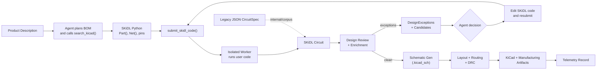
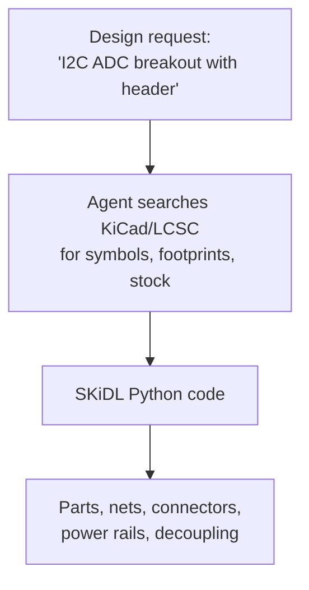
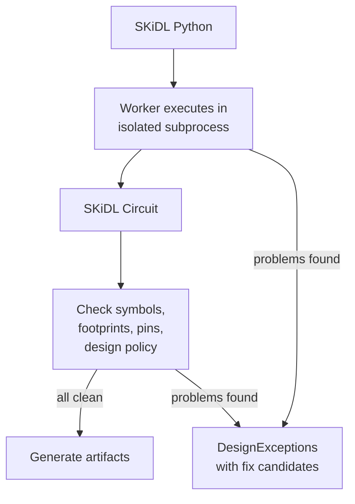
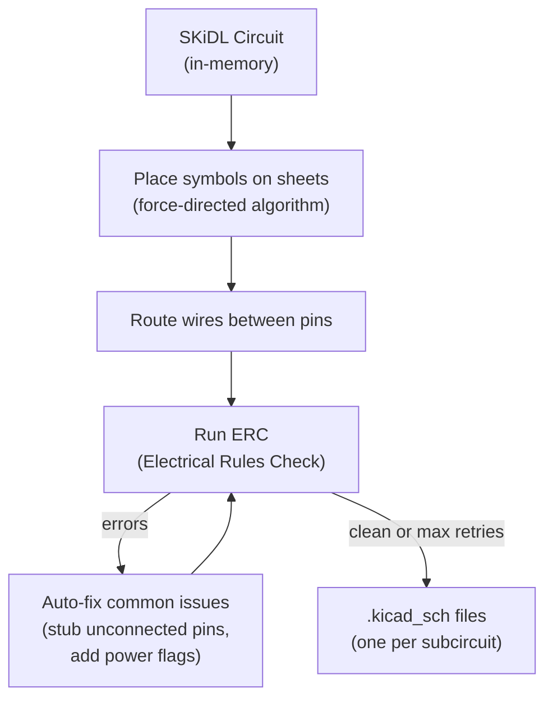
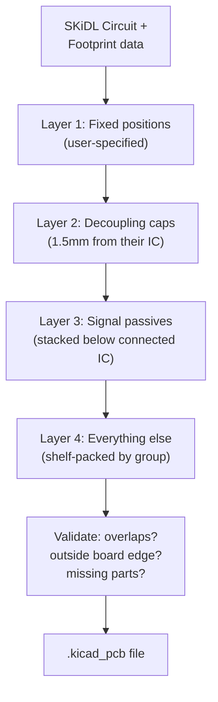
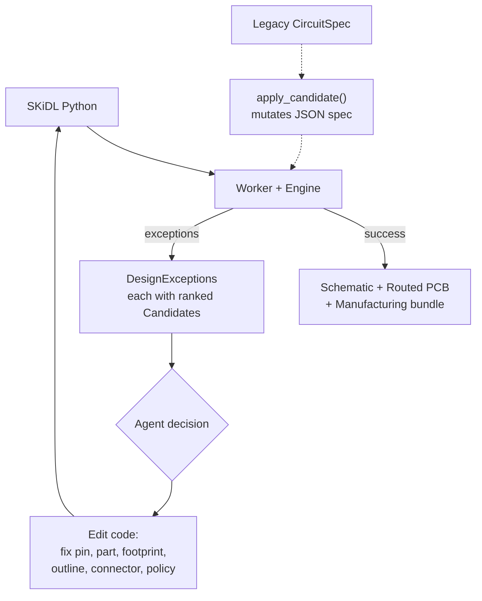
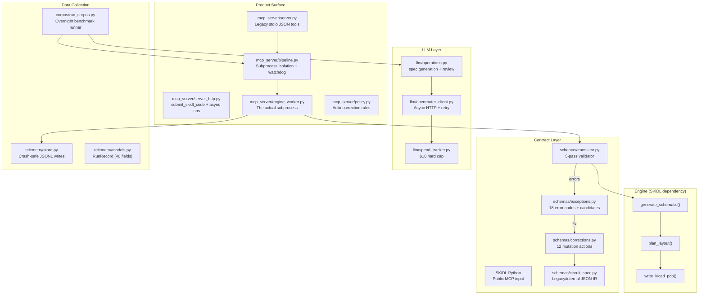
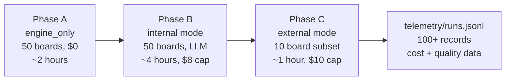

# eda-mcp Architecture

Internal reference doc. Last updated 2026-06-13.

---

## What Is This?

You give an AI agent a product description like "an I2C temperature sensor breakout" and it designs you a PCB. Not a picture of one - an actual KiCad schematic, routed board, and manufacturing bundle you could inspect in KiCad and send to a fab house.

eda-mcp is the engine that makes this work. The public MCP surface now accepts SKiDL Python code through `submit_skidl_code()`. The agent writes real SKiDL (`Part()`, `Net()`, pin connections), while the server owns schematic generation, placement, routing, DRC, artifact packaging, and manufacturing output. When something goes wrong - a pin name doesn't exist, parts overlap on the board, a footprint isn't installed - it doesn't just fail. It returns structured exceptions and candidate fixes the agent can use to edit the SKiDL code and resubmit.

CircuitSpec JSON still exists, but it is now a legacy/internal surface: useful for corpus runners, deterministic translator tests, and compatibility checks. It should not be the default agent UX. New clients should use `search_kicad()` -> `submit_skidl_code()` -> `get_job()` -> `get_run()`.

---

## The Big Picture

---

## Processing Stages — What Happens At Each Step

### Stage 1: From Words to SKiDL

**What it does:** The agent turns intent into executable SKiDL. It should search before coding, use exact KiCad library/part/footprint names, set power rails to `POWER`, include connectors, and add enough passives to make the board physically and electrically plausible.

**What can go wrong:** The agent picks a pin name that doesn't exist, uses a footprint from a library that isn't installed, forgets a connector, or writes invalid SKiDL. That's fine - the pipeline returns structured exceptions and the agent edits the code.

### Stage 2: Validation And Circuit Extraction

**What it does:** The worker runs user code out-of-process, extracts the SKiDL circuit, checks it against installed KiCad resources and product policy, and maps failures into structured exceptions.

**Why it matters:** The agent said pin "VDD" but the real symbol calls it "IOVDD"? The engine can return valid pin names and ranked candidates. No AI is needed for that part - it is filesystem lookups, SKiDL/KiCad introspection, and deterministic policy.

### Stage 3: Schematic Generation

**What it does:** Converts the validated circuit into actual KiCad schematic files. Components are placed using a force-directed algorithm (things that connect pull toward each other), wires are routed, and KiCad's built-in electrical rules check runs up to 8 iterations with auto-fixes for common nuisance errors.

### Stage 4: PCB Layout

**What it does:** Places physical components on the board in priority order. Decoupling capacitors get placed right next to their IC (the engine detects them by value pattern — "100nF" — and power net connections). Parts in the same subcircuit group cluster together. Validation checks for overlaps and boundary violations.

### Stage 5: Telemetry

Every single run — success, failure, timeout, crash — produces exactly one record in `telemetry/runs.jsonl`. The record captures everything: how long it took, how much it cost, how many corrections were needed, layout quality metrics, what went wrong if it failed. This is crash-safe (writes even on KeyboardInterrupt) and concurrent-safe (atomic append).

---

## The Correction Loop - The Core Innovation

This is what makes eda-mcp a product, not just a script.

**How an exception looks:**

The spec says `U1.VBUS` but the real chip only has pins `VCC, GND, SDA, SCL`. The engine returns:

| Candidate | Action | Fix |
|-----------|--------|-----|
| c1 | replace_pin | Change `U1.VBUS` to `U1.VCC` |
| c2 | replace_pin | Change `U1.VBUS` to `U1.SDA` |
| c3 | remove_net_pin | Drop this connection entirely |

For SKiDL Python runs, the agent edits the code (for example replacing `u1["VBUS"]` with `u1["VCC"]`) and submits again. For legacy CircuitSpec runs, `apply_correction()` can still mutate JSON specs directly, but that path is no longer the public product surface.

**The 12 correction actions:**

| Action | What it does | Example |
|--------|-------------|---------|
| replace_lib | Swap a symbol library | `Sensor` -> `Sensor_Temperature` |
| replace_part | Swap a part name | `MCP9808` -> `MCP9808_MSOP` |
| replace_pin | Swap a pin reference | `U1.VDD` -> `U1.IOVDD` |
| replace_footprint | Swap a footprint | `R_0603_bad` -> `R_0603_1608Metric` |
| remove_part | Delete a component + clean nets | Remove `U3` and all its connections |
| remove_net_pin | Drop one pin from a net | Remove `U1.NC` from net `SDA` |
| stub_net | Mark net as label-only | Don't route `ALERT` as a wire |
| set_form_factor | Apply standard board shape | `feather` (51x23mm) |
| set_outline | Set custom board size | 60mm x 40mm |
| scale_outline | Grow the board | Area x 1.44 (sides x 1.2) |
| accept_advisory | Waive a warning | "Yes I know congestion is high" |
| regenerate | Just try again | Same spec, fresh run |

---

## Module Map

---

## Key Design Decisions

**Why a subprocess per run?**
SKiDL uses global state (there's one "default circuit" shared across the whole Python process). Running two boards at once would corrupt them both. The subprocess boundary also gives us a clean kill switch — if a board hangs, we SIGKILL the entire process group. Clean, reliable, no leaked state.

**Why JSON, not Python?**
The original SKiDL workflow is Python scripts. But you can't safely let an AI agent write and execute arbitrary Python. JSON specs are pure data: validatable, diffable, storable, replayable. The correction loop stays in JSON end-to-end — no code generation or eval anywhere.

**Why Llama 70B, not Claude/GPT-4?**
Cost. The overnight run processes 50+ boards with multiple correction iterations each. At $0.10/$0.32 per million tokens, Llama 3.3 70B keeps the whole run under $10. The prompts are designed for mid-tier success: rigid schemas, worked examples, one repair retry, and a deterministic fallback when the model produces garbage.

**Why atomic JSONL, not a database?**
One file, no dependencies, crash-safe by construction. Each record is written with a single `os.write()` syscall on an `O_APPEND` file descriptor. If the process dies mid-run, you lose at most one partial line at the end — the tolerant reader skips it. No Postgres, no SQLite, no migration scripts.

**Why candidates, not error messages?**
A traditional engine returns "pin VBUS not found" and the agent has to figure out what to do. eda-mcp returns "pin VBUS not found, here are the 4 real pins on this chip, pick one." The agent's job reduces from "understand electronics and debug the problem" to "pick option 1, 2, or 3." A Llama 70B can do that. A frontier model isn't needed.

---

## Overnight Corpus Run

The corpus runner drives 50 Adafruit benchmark boards + 10 reference designs through the pipeline in three phases:

**Phase A** uses pre-extracted JSON specs (ground truth from existing benchmark circuits). This measures: "how well does the engine perform with perfect input?"

**Phase B** starts from marketing descriptions, has the LLM generate specs from scratch, and uses LLM-reviewed corrections. This measures: "how well does the full product work end-to-end, and what does it cost?"

**Phase C** reframes the review prompts as a third-party agent consuming the API. This measures: "does the MCP tool surface work for external consumers?"

The morning data seeds the pricing model: per-board cost distribution, which boards are hard, where mid-tier models fail, and whether the correction loop converges.
